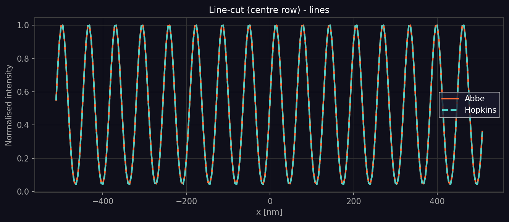
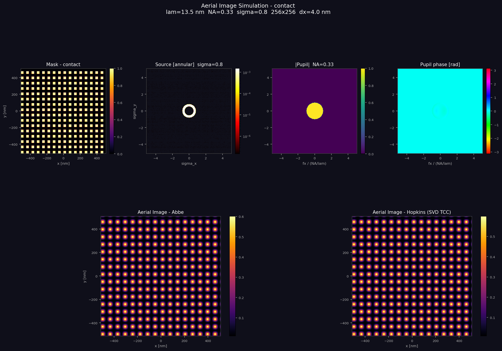
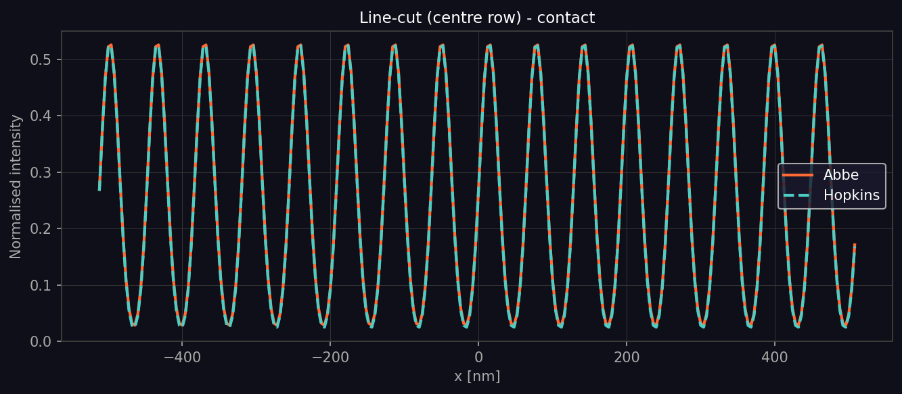
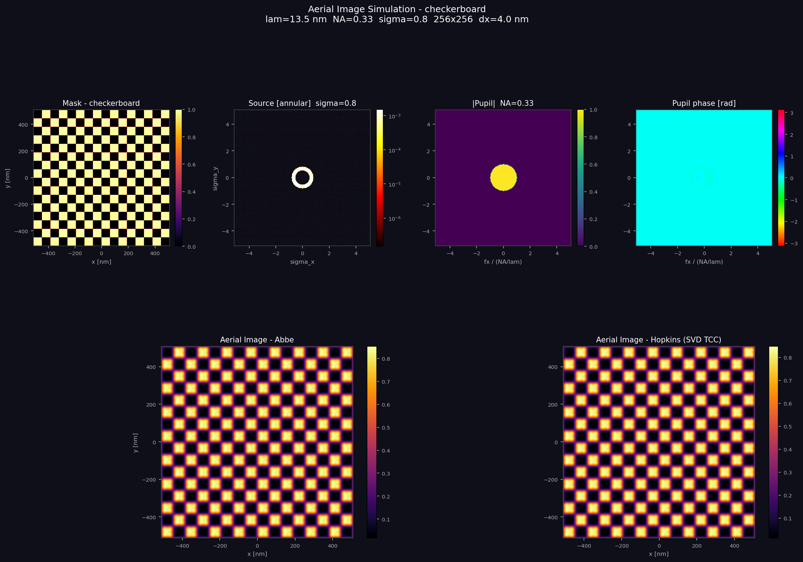
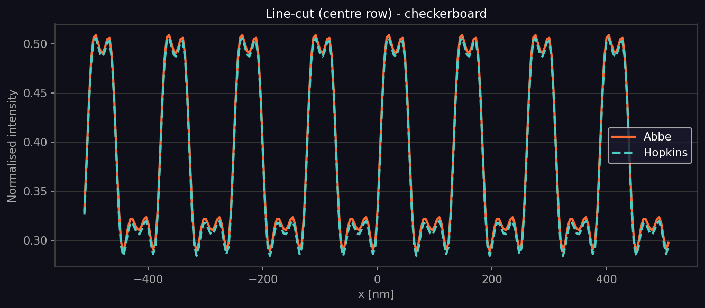
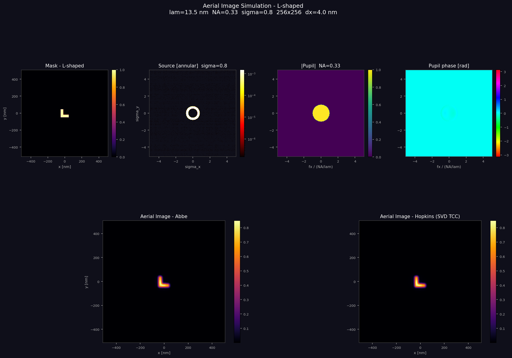
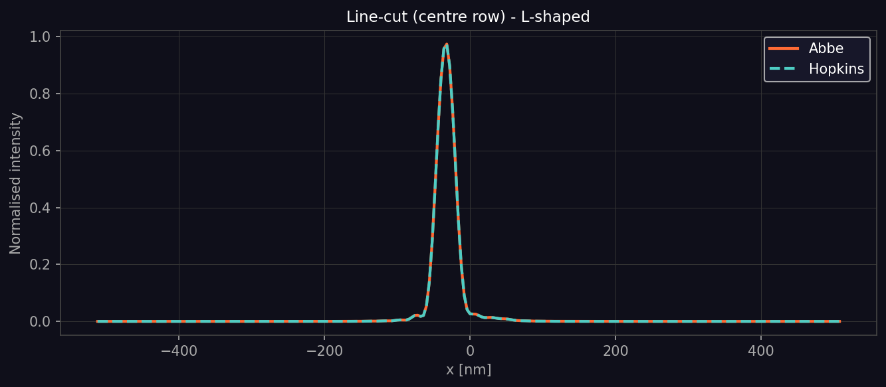

# CLAUDE.md

This file provides guidance to Claude Code (claude.ai/code) when working with code in this repository.

## Running the simulation

```bash
python aerial_image_sim.py
```

This runs all four mask patterns sequentially and writes outputs to the current directory. Requires `numpy`, `matplotlib`, and `gdstk` (or `gdspy` as fallback for OASIS export).

## Architecture

The entire simulation lives in `aerial_image_sim.py`, structured as a pipeline of independent modules:

1. **`OpticalSystem` dataclass** — single source of truth for all optical parameters (wavelength, NA, sigma, grid size). Passed by reference through every stage. All lengths are in **nanometres**; all spatial frequencies in **1/nm**.

2. **Coordinate grids** (`make_grids`) — produces spatial `(X, Y)` and frequency `(FX, FY)` meshgrids, both centered (fftshift convention). Used by source, pupil, mask, and both simulation methods.

3. **Source** (`make_source`) — discrete illumination pupil sampled on the frequency grid. Supports `conventional`, `annular`, `dipole`, and `quasar` shapes. Normalised so `sum == 1`.

4. **Pupil** (`make_pupil`) — coherent transfer function (complex-valued). Supports Zernike aberrations via `zernike_coeffs={(n, m): coeff_waves}`.

5. **Mask** (`make_mask`) — binary amplitude mask, four patterns: `lines`, `contact`, `L-shaped`, `checkerboard`. CD and pitch in nm.

6. **Simulation methods** — two independent implementations of partially coherent aerial image:
   - **Abbe** (`abbe_simulation`): direct incoherent sum over source points. Exact but O(N_source) FFTs.
   - **Hopkins** (`hopkins_simulation`): SVD decomposition of the Transmission Cross Coefficient (TCC). `n_svd` controls truncation; default 30 terms. More efficient for many source points.

7. **Outputs** — per-pattern PNG aerial images and linecut plots, `.oas` mask files (OASIS via gdstk), and `source_distribution.csv` (sparse source point export).

## Generated figures

Each pattern produces two PNG files. All simulations use λ=13.5 nm (EUV), NA=0.33, annular source (σ_inner=0.55, σ_outer=0.8), 256×256 grid, dx=4 nm, and Zernike coma (n=3, m=1)=0.02 waves.

### `aerial_image_<pattern>.png` — 6-panel summary

| Panel | Content |
|-------|---------|
| Mask | Binary chrome/clear layout in spatial coordinates [nm] |
| Source | Annular ring in normalised pupil coords (log scale); inner/outer radii at σ=0.55/0.8 |
| \|Pupil\| | Uniform circular disk (amplitude=1 inside NA, 0 outside) |
| Pupil phase | Near-uniform ~0 rad (cyan) with a faint vertical gradient from the Zernike coma term |
| Aerial Image – Abbe | Intensity map from direct incoherent source sum |
| Aerial Image – Hopkins | Intensity map from SVD-truncated TCC (30 terms); visually identical to Abbe |

### `aerial_linecut_<pattern>.png` — centre-row linecut

Horizontal slice through the image centre, normalised to peak intensity. Abbe (orange solid) and Hopkins (cyan dashed) are overlaid to show agreement.

### Per-pattern observations

**`lines`** (cd=32 nm, pitch=64 nm, transmission=0.50)
- Clear periodic vertical fringes; intensity swings from ~0.03 to ~0.73, giving good image contrast.
- Linecut shows full-swing sinusoidal oscillation; Abbe–Hopkins RMS = 0.00267.




**`contact`** (cd=32 nm, pitch=64 nm, transmission=0.25)
- 2D array of rounded bright spots; peak intensity ~0.60 — lower than lines because energy is spread across both spatial-frequency axes simultaneously.
- Linecut peaks at ~0.5 with near-zero background.




**`checkerboard`** (cd=32 nm, pitch=64 nm, transmission=0.50)
- Alternating squares produce a raised background floor (~0.29 normalised) due to the strong 2D frequency content of the pattern.
- Linecut shows a double-peaked waveform per period (peaks ~0.50) reflecting the 2D crossing structure; largest Abbe–Hopkins RMS (0.00384).




**`L-shaped`** (cd=32 nm, transmission=0.005)
- Single isolated L centred in the field; inner corner is visibly rounded by diffraction; vertical arm slightly brighter than horizontal in the centre-row cut.
- Linecut shows a single narrow peak (~60 nm FWHM) offset slightly left of centre, where the cut intersects the vertical arm; Abbe–Hopkins RMS = 0.00010 (lowest, because the isolated feature has predominantly low spatial-frequency content).




## Key conventions

- The fftshift/ifftshift pair wraps every FFT/IFFT call; the pupil and source are stored in shifted (DC-centered) form.
- Abbe shifts the mask spectrum by rolling the array; Hopkins shifts the pupil instead (sign is negated).
- `write_oasis` uses run-length + row-merge compression to minimise rectangle count before writing.
- If `gdstk` is unavailable, `write_oasis` falls back to `gdspy` and writes GDSII (`.gds`) instead of OASIS (`.oas`).
- If `/mnt/user-data/outputs` exists (container environment), all output files are copied there at the end.
