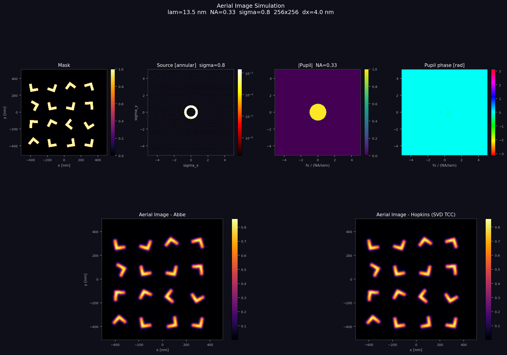
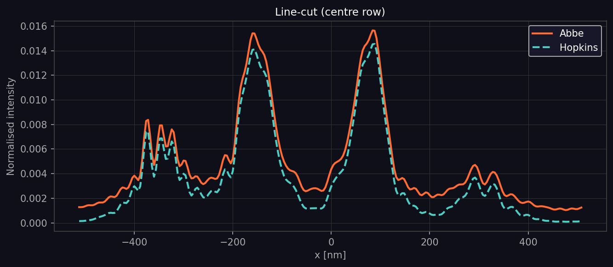

# CLAUDE.md

This file provides guidance to Claude Code (claude.ai/code) when working with code in this repository.

## Commands

**Run aerial image simulation:**
```bash
python sim.py --source <source.csv> --mask <mask.oas> [--n_svd 30] [--output PREFIX]
```

**Generate a custom layout:**
```bash
python generate_layout.py [--seed SEED] [--output PATH]
```

**End-to-end example using the bundled source and generated layout:**
```bash
python generate_layout.py --output multi_L-shaped.oas
python sim.py --source source_distribution.csv --mask multi_L-shaped.oas --output multi_L-shaped
```

Requires: `numpy`, `matplotlib`, `gdstk` (`pip install gdstk`).

## Architecture

Two scripts; source and mask are always **read from files**, never generated in code.

### `sim.py` — simulation pipeline

1. **`read_source_csv(filepath)`** — parses the CSV from `1_basic`. Comment header lines (`#`) carry optical system metadata (wavelength, NA, sigma, grid N, dx), which are used to reconstruct the `OpticalSystem`. Data rows supply `fx_per_nm`, `fy_per_nm`, `intensity` for each non-zero source point, placed back onto the NxN frequency grid.

2. **`read_mask_oas(filepath, sys)`** — reads OASIS via `gdstk`. Uses `matplotlib.path.Path.contains_points` to rasterize each polygon onto pixel centres `((col+0.5)*dx, (row+0.5)*dx)` — supports arbitrary polygon shapes including rotated layouts. Bounding box is used only to restrict which pixels to test, not to fill.

3. **`make_grids` / `make_pupil`** — identical to `1_basic`. Pupil includes a fixed Zernike coma term `(n=3, m=1): 0.02 waves`.

4. **`abbe_simulation` / `hopkins_simulation`** — identical to `1_basic`. `--n_svd` controls Hopkins SVD truncation (default 30).

5. **Plotting** — `plot_results` (6-panel summary) and `plot_linecuts` (centre-row linecut), saved as `<PREFIX>_aerial_image.png` and `<PREFIX>_linecut.png`.

### `generate_layout.py` — layout generator

Creates an OASIS file with 8 L-shaped polygons (arm width=32 nm, arm length=96 nm) at random orientations on a 4×2 grid (pitch=220 nm, origin offset=150 nm). The 150 nm offset ensures rotated L-shapes (max radius ~68 nm) stay fully within the 1024×1024 nm simulation field.

Key functions: `l_shape_vertices(w, h)` returns the 6 canonical vertices centred at origin; `rotate(pts, angle_deg)` applies a 2D rotation matrix; `translate(pts, dx, dy)` shifts to the grid position.

### Unit convention

All lengths in **nm**, all spatial frequencies in **1/nm** — consistent with `1_basic`.

### Relationship to 1_basic

`1_basic/aerial_image_sim.py` generates masks and source in-code then exports them. This folder consumes those exports. `source_distribution.csv` is copied from `1_basic` and bundled here for convenience.

## Example output: multi_L-shaped

8 L-shapes (arm width=32 nm, arm length=96 nm) at random orientations, placed on a 4×2 grid (pitch=220 nm, offset=150 nm). Simulated with λ=13.5 nm EUV, NA=0.33, annular source (σ=0.55–0.8), 256×256 grid, dx=4 nm.

**`multi_L-shaped_aerial_image.png`** — 6-panel summary showing the rasterized mask with 8 distinct L orientations and the corresponding Abbe and Hopkins aerial images. Each L appears as a diffraction-blurred spot with an asymmetric L profile. Mask transmission is ~3.9% (sparse isolated features). Abbe–Hopkins normalised RMS = 0.00054, consistent with the single L-shape case.



**`multi_L-shaped_linecut.png`** — horizontal cut through the image centre (y=0 nm in simulation coordinates = y=512 nm in OAS coordinates), which falls above both rows of L-shapes (at OAS y=150 and y=370 nm). Consequently, the centre row captures only diffraction tails: normalised intensities are tiny (~0.001). The apparent 2× discrepancy between Abbe and Hopkins in the linecut reflects differences in the diffraction tail background at that level, not a simulation error — the absolute difference is ~0.05% of peak, consistent with the overall RMS.


